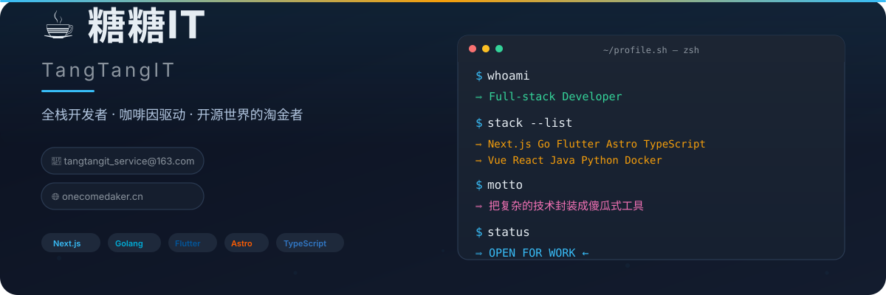

<p align="center">
  
</p>

---

<p align="center">
  
</p>

- 🔭 **正在探索**：AI 与 Web 应用的交汇点，利用大模型赋能轻量级产品
- 🧠 **技术信仰**：热爱把复杂的技术封装成傻瓜式工具，让开发者事半功倍
- 🌅 **最新作品**：[Morning Quote](https://morning-quote.com/) - 极简免登录晨间语录卡片生成器
- 🏠 **博客/作品集**：[onecomedaker.cn](https://onecomedaker.cn) 
- 📫 **联系我**：tangtangit_service@163.com

---

<p align="center">
  
</p>

| 领域 | 技术选型 |
| :--- | :--- |
| **前端** | Vue / React / TypeScript / TailwindCSS |
| **后端** | Java / Node.js |
| **移动端** | Flutter / Android (Kotlin) / iOS (Swift) |
| **跨端/桌面** | Tauri / Electron |
| **博客/内容** | Astro / Mizuki 主题 |
| **AI 相关** | Python / 大模型 API 集成 |

---

<p align="center">
  
</p>

<!-- 这里会自动展示你最近创建或推送的仓库，不需要手动写 -->
```bash
# 最近在忙：
- m3u8在线视频播放器 | 多语言文本转语音的TTS·免费在线
- 📖 研究 AI Agent 与浏览器自动化结合
- ☕ 寻找更好的手冲咖啡豆（误）
```
